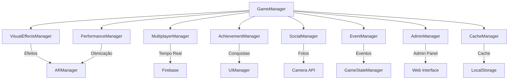

# Design - Melhorias de Performance e Experiência do Usuário

## Visão Geral

Este documento detalha o design técnico para implementar melhorias significativas de performance e experiência do usuário no jogo Ghostbusters AR. O design mantém a arquitetura modular existente enquanto adiciona novos sistemas para feedback visual, multiplayer, conquistas, compartilhamento social, eventos sazonais e administração.

## Arquitetura

### Arquitetura Atual
O jogo utiliza uma arquitetura modular com os seguintes componentes principais:
- **GameManager**: Orquestrador principal (main.js)
- **AuthManager**: Gerenciamento de autenticação
- **GameStateManager**: Estado do jogo e lógica de negócio
- **ARManager**: Realidade aumentada e renderização 3D
- **UIManager**: Interface do usuário
- **MapManager**: Mapa e geolocalização
- **QRManager**: Scanner de QR codes

### Novos Componentes Propostos



## Componentes e Interfaces

### 1. VisualEffectsManager

**Responsabilidade**: Gerenciar todos os efeitos visuais do jogo

```javascript
class VisualEffectsManager {
    constructor() {
        this.particleSystem = null;
        this.animationQueue = [];
        this.activeEffects = new Map();
    }

    // Efeitos principais
    showProtonBeamEffect(startPos, endPos)
    showCelebrationEffect(position, type)
    showSuctionEffect(ghostPos, trapPos)
    showInventoryFullEffect(element)
    showAchievementUnlock(achievement)
    
    // Controle de performance
    setQualityLevel(level) // low, medium, high
    pauseAllEffects()
    resumeAllEffects()
}
```

### 2. PerformanceManager

**Responsabilidade**: Monitorar e otimizar performance do jogo

```javascript
class PerformanceManager {
    constructor() {
        this.frameRate = 60;
        this.memoryUsage = 0;
        this.qualityLevel = 'auto';
        this.performanceMetrics = {};
    }

    // Monitoramento
    startPerformanceMonitoring()
    getFrameRate()
    getMemoryUsage()
    
    // Otimização automática
    adjustQualityBasedOnPerformance()
    optimizeARRendering()
    cleanupUnusedResources()
    
    // Configuração
    setTargetFrameRate(fps)
    setQualityLevel(level)
}
```

### 3. MultiplayerManager

**Responsabilidade**: Gerenciar interações multiplayer em tempo real

```javascript
class MultiplayerManager {
    constructor() {
        this.nearbyPlayers = new Map();
        this.currentTeam = null;
        this.realtimeDatabase = null;
    }

    // Descoberta de jogadores
    startPlayerDiscovery(userPosition)
    updatePlayerPosition(position)
    getNearbyPlayers(radius = 100)
    
    // Sistema de equipes
    createTeam(teamName)
    joinTeam(teamId)
    leaveTeam()
    
    // Comunicação
    sendPlayerNotification(playerId, message)
    broadcastToNearbyPlayers(message)
}
```

### 4. AchievementManager

**Responsabilidade**: Sistema de conquistas e progressão

```javascript
class AchievementManager {
    constructor() {
        this.achievements = new Map();
        this.playerProgress = {};
        this.unlockedAchievements = new Set();
    }

    // Definição de conquistas
    defineAchievement(id, criteria, reward)
    checkAchievementProgress(action, data)
    unlockAchievement(achievementId)
    
    // Progressão
    updateProgress(achievementId, progress)
    getPlayerAchievements()
    getAchievementProgress(achievementId)
}
```

### 5. SocialManager

**Responsabilidade**: Fotos e compartilhamento social

```javascript
class SocialManager {
    constructor() {
        this.photoGallery = [];
        this.shareTemplates = new Map();
        this.filters = new Map();
    }

    // Captura de fotos
    captureARPhoto(includeGhost = true)
    applyFilter(photo, filterName)
    addGameStats(photo, stats)
    
    // Compartilhamento
    shareToSocialMedia(photo, platform)
    saveToGallery(photo)
    getPhotoGallery()
}
```

### 6. EventManager

**Responsabilidade**: Eventos sazonais e especiais

```javascript
class EventManager {
    constructor() {
        this.activeEvents = new Map();
        this.eventSchedule = [];
        this.eventRewards = new Map();
    }

    // Gerenciamento de eventos
    checkActiveEvents()
    activateEvent(eventId)
    deactivateEvent(eventId)
    
    // Configuração de eventos
    scheduleEvent(event, startDate, endDate)
    getEventRewards(eventId)
    applyEventModifiers(gameState)
}
```

### 7. AdminManager

**Responsabilidade**: Interface de administração para gerenciar dados do jogo diretamente no Firestore.

**Arquitetura**: Modelo "Cliente Confiável". O painel é uma aplicação web separada que interage com o Firestore. A segurança é garantida por Regras de Segurança do Firestore, que concedem permissões de escrita apenas a usuários administradores autenticados. Nenhuma Cloud Function é necessária para as operações CRUD.

```javascript
class AdminManager {
    constructor(firestore, auth) {
        this.db = firestore;
        this.auth = auth;
        this.adminUid = null; // UID do admin logado
    }

    // Autenticação
    login(email, password)
    logout()

    // Gerenciamento de Eventos
    createEvent(eventData)
    updateEvent(eventId, eventData)
    deleteEvent(eventId)
    getEvents()

    // Gerenciamento de Usuários
    getUsers()
    updateUser(userId, userData)
    deleteUser(userId) // Requer Admin SDK para deleção completa
}
```

### 8. CacheManager

**Responsabilidade**: Cache e sincronização offline

```javascript
class CacheManager {
    constructor() {
        this.localCache = new Map();
        this.syncQueue = [];
        this.isOnline = navigator.onLine;
    }

    // Cache local
    cacheData(key, data, ttl)
    getCachedData(key)
    clearExpiredCache()
    
    // Sincronização
    queueForSync(operation)
    syncPendingOperations()
    handleOfflineCapture(ghostData)
}
```

## Modelos de Dados

### Achievement Model
```javascript
{
    id: string,
    name: string,
    description: string,
    icon: string,
    criteria: {
        type: 'capture_count' | 'area_visit' | 'consecutive_days' | 'ghost_type',
        target: number,
        conditions: object
    },
    reward: {
        points: number,
        badge: string,
        unlocks: string[]
    },
    rarity: 'common' | 'rare' | 'epic' | 'legendary'
}
```

### Event Model
```javascript
{
    id: string,
    name: string,
    description: string,
    type: 'seasonal' | 'special' | 'community',
    startDate: Date,
    endDate: Date,
    modifiers: {
        ghostSpawnRate: number,
        pointsMultiplier: number,
        specialGhosts: string[]
    },
    rewards: Achievement[],
    isActive: boolean
}
```

### Player Model (Extended)
```javascript
{
    // Campos existentes
    uid: string,
    displayName: string,
    points: number,
    captures: number,
    
    // Novos campos
    achievements: string[],
    level: number,
    experience: number,
    photoGallery: Photo[],
    socialStats: {
        shares: number,
        likes: number
    },
    preferences: {
        effectsQuality: 'low' | 'medium' | 'high',
        notifications: boolean,
        publicProfile: boolean
    }
}
```

### Photo Model
```javascript
{
    id: string,
    playerId: string,
    timestamp: Date,
    imageData: string, // base64
    metadata: {
        ghostType: string,
        location: string,
        filter: string,
        stats: {
            points: number,
            captureTime: number
        }
    },
    shares: number,
    likes: number
}
```

## Tratamento de Erros

### Estratégia de Recuperação
1. **Conexão Firebase**: Retry automático com backoff exponencial
2. **Câmera AR**: Fallback para modo 2D com instruções
3. **GPS**: Modo de jogo estático com áreas pré-definidas
4. **Memória baixa**: Redução automática de qualidade
5. **Dados corrompidos**: Reset gracioso com backup

### Error Handler Central
```javascript
class ErrorHandler {
    static handleError(error, context) {
        switch(error.type) {
            case 'FIREBASE_CONNECTION':
                return this.handleFirebaseError(error);
            case 'CAMERA_ACCESS':
                return this.handleCameraError(error);
            case 'GPS_UNAVAILABLE':
                return this.handleGPSError(error);
            default:
                return this.handleGenericError(error);
        }
    }
}
```

## Estratégia de Testes

### Testes Unitários
- Cada novo manager terá cobertura de testes >= 80%
- Mocks para APIs externas (Firebase, Camera, GPS)
- Testes de performance para operações críticas

### Testes de Integração
- Fluxo completo de captura com efeitos visuais
- Sincronização offline/online
- Interações multiplayer

### Testes de Performance
- Monitoramento de FPS durante efeitos visuais
- Teste de carga com múltiplos jogadores
- Teste de memória com cache extensivo

## Considerações de Performance

### Otimizações de Renderização
1. **Object Pooling**: Reutilização de objetos 3D
2. **LOD (Level of Detail)**: Redução de qualidade baseada na distância
3. **Frustum Culling**: Não renderizar objetos fora da visão
4. **Texture Compression**: Compressão automática baseada no dispositivo

### Otimizações de Rede
1. **Delta Sync**: Sincronizar apenas mudanças
2. **Compression**: Compressão de dados multiplayer
3. **Batching**: Agrupar operações de rede
4. **Caching Inteligente**: Cache baseado em padrões de uso

### Otimizações de Memória
1. **Lazy Loading**: Carregar recursos sob demanda
2. **Garbage Collection**: Limpeza proativa de recursos
3. **Asset Streaming**: Streaming de assets grandes
4. **Memory Monitoring**: Monitoramento contínuo de uso

## Segurança

### Validação de Dados
- Validação server-side para todas as operações críticas
- Sanitização de inputs do usuário
- Rate limiting para operações de rede

### Proteção contra Cheating
- Validação de posição GPS server-side
- Verificação de timing para capturas
- Detecção de padrões anômalos

### Privacidade
- Opt-in para compartilhamento de dados
- Anonimização de dados analíticos
- Controle granular de privacidadeégia será **reativa**: o administrador poderá analisar os dados dos jogadores através do painel e banir manualmente os usuários que apresentarem padrões suspeitos (ex: pontuações impossíveis).

### Privacidade
- Opt-in para compartilhamento de dados
- Anonimização de dados analíticos
- Controle granular de privacidade